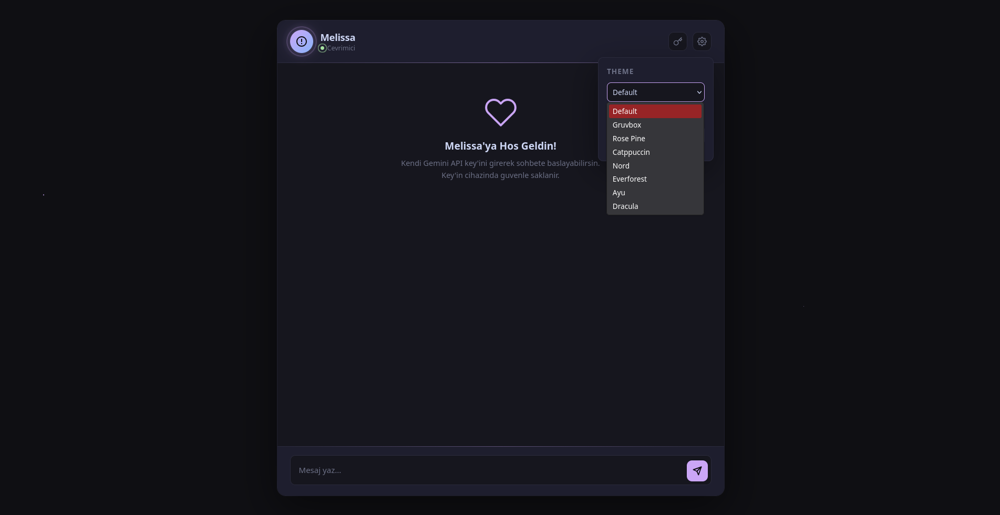

# Melissa

> Your personal AI companion. Beautiful, fast, and completely open-source.


**Melissa** is a beautiful, fast, and privacy-focused AI chat interface powered by Google's Gemini API.

Designed to be simple, lightweight, and completely client-side, Melissa requires no backend, no build system, and no installation process.

---

## Pictures 📷



## ✨ Features

| Feature              | Description                                                                 |
| -------------------- | --------------------------------------------------------------------------- |
| 🎨 **8 Themes**      | Default, Gruvbox, Rose Pine, Catppuccin, Nord, Everforest, Ayu, and Dracula |
| 🔒 **Privacy First** | Your API key is stored only in your browser's `localStorage`                |
| ⚡ **Zero Backend**   | 100% client-side with no servers or tracking                                |
| 🌍 **Bilingual**     | Turkish and English language support                                        |
| ✨ **Animated UI**    | Particle effects, typing indicators, and smooth transitions                 |
| 📱 **Responsive**    | Works on desktop, tablet, and mobile devices                                |
| 🪶 **Lightweight**   | No frameworks, dependencies, or build tools required                        |
| 💬 **AI Chat**       | Powered by Google's Gemini API                                              |

---

## 🚀 Quick Start

### 🌐 Live Demo

Try Melissa directly in your browser:

**[→ Try Melissa Now](https://maxchennn.github.io/melissa/)**

---

### 💻 Local Setup

Clone the repository:

```bash
git clone https://github.com/maxchennn/melissa-ai.git
```

Navigate to the project directory:

```bash
cd melissa-ai
```

Then open `index.html` in your browser.

That's it.

No build step.
No dependencies.
No `npm install`.

```text
melissa-ai/
└── index.html
```

---

## 🔑 Getting Your API Key

Melissa uses Google's Gemini API to generate responses.

To get your API key:

1. Go to **[Google AI Studio](https://aistudio.google.com/)**
2. Click **Create API Key**
3. Copy your API key
4. Open Melissa
5. Paste the key when prompted

Your API key is stored locally in your browser and is only used to communicate with Google's API.

> **Note:** Never share your API key publicly or commit it to a repository.

---

## 🎨 Themes

Melissa includes **8 built-in themes**:

| Theme          | Style                                |
| -------------- | ------------------------------------ |
| **Default**    | Purple gradient on a dark background |
| **Gruvbox**    | Warm retro earth tones               |
| **Rose Pine**  | Soft pink and pine colors            |
| **Catppuccin** | Pastel and dreamy colors             |
| **Nord**       | Arctic-inspired blue tones           |
| **Everforest** | Natural green colors                 |
| **Ayu**        | Deep ocean-inspired dark colors      |
| **Dracula**    | Classic neon purple and pink         |

To change the theme:

1. Open Melissa
2. Click the **Settings** icon in the top-right corner
3. Select your preferred theme

Your theme preference is saved automatically.

---

## ⌨️ Keyboard Shortcuts

| Key             | Action         |
| --------------- | -------------- |
| `Enter`         | Send message   |
| `Shift + Enter` | Add a new line |

---

## 📁 Project Structure

```text
melissa-ai/
├── index.html    # Main application
└── README.md     # Project documentation
```

The entire application is contained inside a single HTML file.

This includes:

* HTML structure
* CSS styling
* Theme definitions
* Animations
* JavaScript logic
* Gemini API integration

---

## 🛠️ Customization

### Adding a New Theme

Themes are defined directly inside `index.html`.

Add a new CSS selector using the `data-theme` attribute:

```css
[data-theme="your-theme"] {
    --bg-dim: #...;
    --bg-main: #...;
    --bg-soft: #...;
    --bg-element: #...;

    --fg-main: #...;
    --fg-muted: #...;

    --accent: #...;
    --accent-secondary: #...;

    --success: #...;
    --error: #...;
}
```

Then add the theme to the theme selector:

```html
<option value="your-theme">Your Theme Name</option>
```

---

## ❓ FAQ

### Is my API key safe?

Your API key is stored locally in your browser's `localStorage`.

Melissa does not have a backend and does not send your key anywhere except the API service required to generate AI responses.

> For maximum security, avoid using API keys that you do not want exposed in a client-side application.

---

### Can I use Melissa without an internet connection?

No.

Melissa needs an internet connection to communicate with Google's Gemini API.

---

### Can I use a different AI model?

Currently, Melissa supports Google's Gemini API.

Support for other AI providers such as Claude and OpenAI may be added in the future.

---

### Why don't responses use Markdown?

Melissa intentionally uses clean, plain text responses.

The goal is to keep the chat interface simple, readable, and distraction-free.

---

## 🤝 Contributing

Contributions, suggestions, and improvements are welcome.

If you have an idea:

1. Fork the repository
2. Create a new branch

```bash
git checkout -b feature/your-feature
```

3. Make your changes
4. Commit your changes

```bash
git commit -m "Add your feature"
```

5. Push your branch

```bash
git push origin feature/your-feature
```

6. Open a Pull Request

---

## 🐛 Issues & Suggestions

Found a bug or have an idea?

Feel free to open an issue on the GitHub repository.

Every suggestion is appreciated.

---

## 👤 Creator

Made with ❤️ by **maxchennn**.

---

## 📄 License

This project is licensed under the **MIT License**.

You are free to:

* Use the project
* Modify the project
* Distribute the project
* Use it commercially

Just keep the original credit.

---

<p align="center">
  Made with ❤️ and ☕ by <strong>maxchennn</strong>
</p>
